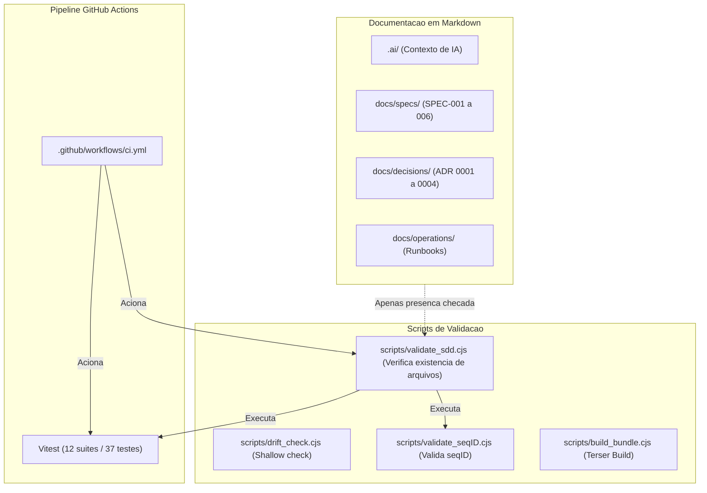

# Auditoria Independente do SDD 2.0 (Fase 7A)

**Projeto:** Jornada TCG Team  
**Base:** Release Certificada v1.9.3 (Commit `7f768f4`)  
**Data:** 15 de Agosto de 2026  
**Auditor:** Agente Independente de Governanca SDD, Arquitetura e QA  
**Padrao de Classificacao:** Factual, Cético e Orientado a Evidencias  

---

# Executive Summary

Esta auditoria realizou uma avaliacao cética e independente sobre o estado real do **Spec-Driven Development (SDD)** no projeto Jornada TCG Team.

Diferenciamos rigorosamente entre o que esta apenas documentado em arquivos Markdown e o que esta de fato implementado, automatizado, testado e governado por pipelines de CI/CD.

**Principais Conclusoes:**
1. O projeto possui excelente suite de testes unitarios/integracao no Vitest (12 suites / 37 testes com 100% PASS) e documentacao rica em `.ai/`, `docs/specs/` e `docs/audit/`.
2. Contudo, o **SDD Validator** (`scripts/validate_sdd.cjs`) e o **Drift Detector** (`scripts/drift_check.cjs`) realizam apenas verificacoes superficiais de presenca de arquivos em disco (`fs.existsSync`), nao analisando AST, contratos de schema ou divergencias reais entre texto da spec e codigo.
3. Nao existe engine executavel de ciclo de vida de especificacoes (`DRAFT -> VERIFIED`), nem rastreabilidade automatizada bidirecional entre specs e commits.
4. O processo de release nao utiliza Git Tags automatizadas, existindo apenas bumps no `package.json` e `version.json`.

---

# Methodology & Criterios de Classificacao

Utilizamos 5 niveis rigorosos de avaliacao de capacidade:
- **DOCUMENTED ONLY:** Existe arquivo Markdown descrevendo a capacidade, mas nao ha script ou codigo executando a verificacao.
- **IMPLEMENTED BUT NOT GOVERNED:** Existe codigo/script, mas nao e acionado por gates ou pipelines continuos.
- **TESTED BUT NOT GATED:** Existe teste unitario local, mas nao impede merge/deploy automaticamente no CI.
- **GATED BUT NOT TRACEABLE:** Executado no CI/CD, mas nao gera evidencias estruturadas ou rastreabilidade.
- **FULLY GOVERNED:** Possui especificacao formal, implementacao real, suite de testes automatizada, gate bloqueante no CI/CD e evidencias auditaveis.

---

# Current SDD Architecture



---

# Existing Capabilities & Evidencias Factuais

| Capacidade | Localizacao | Implementacao Real | Automacao | CI/CD | Evidencia | Classificacao |
|---|---|---|---|---|---|---|
| **Matriz de Testes Unitarios** | `tests/*.test.js` | 12 suites Vitest | `npm test` | Sim | 37 testes PASS | **FULLY GOVERNED** |
| **Integracao DOM Real** | `tests/dom_integration.test.js` | JSDOM no Vitest | `npm test` | Sim | 4 testes PASS | **FULLY GOVERNED** |
| **Invariantes de seqID** | `scripts/validate_seqID.cjs` | Script de sequenciamento | No SDD Gate | Sim | Script exit 0 | **FULLY GOVERNED** |
| **Verificacao de Presenca de Arquivos** | `scripts/validate_sdd.cjs` | `fs.existsSync` | `npm run validate:sdd` | Sim | 32 PASS | **GATED BUT NOT TRACEABLE** |
| **Deteccao de Drift** | `scripts/drift_check.cjs` | Shallow `fs.existsSync` | `npm run drift:check` | Nao (fora do CI) | Output local | **IMPLEMENTED BUT NOT GOVERNED** |
| **Especificacoes de Dominio** | `docs/specs/*.md` | Markdown estatico | Nenhuma | Nao | Arquivos .md | **DOCUMENTED ONLY** |
| **Registros de Decisao (ADR)** | `docs/decisions/*.md` | Markdown estatico | Nenhuma | Nao | Arquivos .md | **DOCUMENTED ONLY** |
| **Contexto de IA** | `.ai/*.md` | Markdown estatico | Nenhuma | Nao | 7 arquivos | **DOCUMENTED ONLY** |
| **Runbooks Operacionais** | `docs/operations/*.md` | Markdown estatico | Nenhuma | Nao | 4 arquivos | **DOCUMENTED ONLY** |
| **Contratos de Dados (Schemas)** | Nenhum JSON Schema | Tipagem implicita | Nenhuma | Nao | Nenhuma | **DOCUMENTED ONLY** |

---

# Specification Lifecycle

- **Status Declarado nos Arquivos:** As especificacoes `SPEC-001` a `SPEC-006` trazem no cabecalho a linha `Status: NORMATIVE / VERIFIED`.
- **Avaliacao Factual:** **NÃO EXISTE** engine de ciclo de vida. O status e apenas texto livre estatico. Nao ha parser ou script que valide mudancas de estado entre `DRAFT`, `PROPOSED`, `ACCEPTED`, `IMPLEMENTED` e `VERIFIED`.

---

# Traceability (Rastreabilidade Spec -> Code -> Test)

- **Status Real:** **PARCIAL (Manual).**
- **Evidencia:** As relacoes entre `SPEC-001` e `quicklog.js` ou `SPEC-004` e `api/auth.js` existem conceitualmente e estao documentadas nas tabelas de relatorios de auditoria (`PHASE-6-RELEASE-CERTIFICATION.md`), mas **nenhum script extrai ou valida essa ligacao automaticamente via AST ou tags de teste**.

---

# Drift Detection Audit

- **Diagnostico do Script `scripts/drift_check.cjs`:**
  O script atual executa 5 linhas de `fs.existsSync`:
  ```javascript
  checkDrift(fs.existsSync(path.join(rootDir, 'js', 'stats.js')), 'Codigo js/stats.js alinhado...');
  ```
- **Limitacao Factual:** O script **nao detecta drift real**. Se uma funcao for renomeada ou removida de `js/stats.js`, o script continuara reportando `EM CONFORMIDADE` desde que o arquivo exista em disco.
- **Classificacao:** **SHALLOW DRIFT DETECTION (Apenas checagem de existencia de arquivo).**

---

# SDD Validator Audit

- **Diagnostico de `scripts/validate_sdd.cjs`:**
  - Valida a presenca de uma lista hardcoded de 27 arquivos Markdown.
  - Executa `validate_seqID.cjs`, `vitest` e `build_bundle.cjs`.
- **Falsos Positivos:** Se um arquivo Markdown estiver completamente vazio ou com conteudo corrompido, o gate aprova como PASS porque usa `fs.existsSync`.
- **Falsos Negativos:** Se uma nova spec for criada (ex: `SPEC-007`), o validator nao a reconhece nem a cobra sem alteracao manual no codigo do script.

---

# CI/CD Governance Audit

- **Diagnostico de `.github/workflows/ci.yml`:**
  - Roda em `push` e `pull_request` para a branch `main`.
  - Executa `npm ci`, `npx vitest run` e `node scripts/validate_sdd.cjs`.
- **Pontos Fortes:** Bloqueia quebras de sintaxe, falhas em testes unitarios e bundle com erros de compilacao Terser.
- **Lacunas Identificadas:**
  - Nao executa `npm run drift:check`.
  - Nao publica relatorios de cobertura ou evidencias de teste como GitHub Artifacts.
  - Nao valida formatacao/linting antes do build.

---

# AI Readiness & AI Task Governance

- **AI Readiness Score:** **BOM (4.2 / 5.0)**
  - O diretorio `.ai/` fornece guia claro de arquitetura, pontos de atencao (`KNOWN_PITFALLS.md`) e regras de proibicao (`DO_NOT.md`).
- **AI Task Governance:** **PARCIAL (Documentado em `CHANGE_WORKFLOW.md`, mas nao forcado por CLI/Tooling).**
  - O protocolo de mudanca existe como guia de boas praticas, dependendo da disciplina do agente.

---

# Data Contracts & Schemas

- **Diagnostico:** Os modelos de dados (`Match`, `Deck`, `Player`, `SyncPayload`) estao descritos informalmente em Markdown e validados por regras inline de codigo (ex: `Array.isArray(manualMatches)` em `api/sync.js`).
- **Lacuna:** Nao existem arquivos JSON Schema (`.schema.json`) formais ou validadores baseados em JSON Schema (ex: Ajv).
- **Classificacao:** **DOCUMENTED ONLY / IMPLICIT CODE VALIDATION.**

---

# Human Decisions & Technical Debt

- **Decisoes Humanas:** Documentadas em `docs/roadmap/HUMAN-DECISIONS.md` e `docs/audit/HUMAN-DECISIONS-AUTHORIZATION.md`.
- **Divida Tecnica:** Nao ha arquivo centralizado de backlog de divida tecnica (como `docs/TECH_DEBT.md`), estando distribuida entre os relatorios de auditoria.

---

# Release Governance & Version Consistency

- **Diagnostico de Versao:**
  - `package.json`: `1.9.3`
  - `version.json`: `1.9.3`
  - Commit atual: `7f768f4`
- **Inconsistencia Detectada:**
  - O comando `git tag` retornou **vazio**. O projeto **nao cria Git Tags** (ex: `v1.9.3`) ao realizar bumps de versao, existindo apenas commits na branch `main`.
  - Falta rastreabilidade formal via Git Tags e GitHub Releases.

---

# Known Limitations Registradas

Auditamos as 4 limitacoes descobertas na Fase 4 e 5:

| Limitacao | Onde esta documentada | Status no SDD |
|---|---|---|
| 1. Serializacao canonica de chaves planas | `PHASE-4-VALIDATION.md`, `PHASE-6-RELEASE-CERTIFICATION.md` | **ACCEPTED LIMITATION** |
| 2. Retencao de tombstones em 180 dias | `PHASE-5-REMEDIATION.md`, `PHASE-6-RELEASE-CERTIFICATION.md` | **ACCEPTED LIMITATION** |
| 3. Dependencia de `JWT_SECRET` em prod | `environment.md`, `PHASE-5-REMEDIATION.md` | **CRITICAL RUNBOOK NOTE** |
| 4. Autorizacao colaborativa de time | `HUMAN-DECISIONS-AUTHORIZATION.md` | **PROPOSED / HUMAN REVIEW** |

---

# Matriz de Maturidade do SDD (Maturity Matrix)

| Capacidade SDD | DOCUMENTED | IMPLEMENTED | AUTOMATED | TESTED | CI | EVIDENCE | Classificacao |
|---|---|---|---|---|---|---|---|
| **Domain Specs** | SIM | SIM | NAO | SIM | PARCIAL | SIM | **PARTIAL** |
| **ADR Governance** | SIM | SIM | NAO | NAO | PARCIAL | SIM | **DOCUMENTED ONLY** |
| **AI Context (.ai/)** | SIM | SIM | NAO | NAO | PARCIAL | SIM | **DOCUMENTED ONLY** |
| **Unit Test Matrix** | SIM | SIM | SIM | SIM | SIM | SIM | **FULLY GOVERNED** |
| **DOM Integration Tests** | SIM | SIM | SIM | SIM | SIM | SIM | **FULLY GOVERNED** |
| **seqID Invariant Gate** | SIM | SIM | SIM | SIM | SIM | SIM | **FULLY GOVERNED** |
| **SDD File Existence Gate**| SIM | SIM | SIM | SIM | SIM | SIM | **GATED (SHALLOW)** |
| **Drift Detection Engine** | SIM | PARCIAL | NAO | NAO | NAO | NAO | **DOCUMENTED ONLY** |
| **Data Contract Schemas** | SIM | PARCIAL | NAO | PARCIAL| NAO | NAO | **DOCUMENTED ONLY** |
| **Release / Git Tagging** | SIM | PARCIAL | NAO | NAO | NAO | NAO | **PARTIAL** |

---

# Classificacao de Maturidade SDD Real

### Nivel Real de Maturidade: **NÍVEL 3 — SPECIFICATION & TEST GATED (Prático)**

- **O que temos:** Testes automatizados robustos, CI funcional que bloqueia quebras de build/testes, presenca de documentacao de dominio e reconciliacao historica.
- **O que falta para Nivel 4 / 5:**
  1. Drift detector real baseado em parser AST de codigo vs especificacao.
  2. Lifecycle executavel de specs (`DRAFT -> VERIFIED`).
  3. Contratos de dados formais (JSON Schema).
  4. Git Tags automatizadas no fluxo de release.

---

# GAPs Identificados na Auditoria SDD

| GAP ID | Severidade | Categoria | Descricao |
|---|---|---|---|
| **GAP-SDD-001** | **P2 - MEDIUM** | Drift Detection | `scripts/drift_check.cjs` apenas checa `fs.existsSync` e nao esta no pipeline de CI. |
| **GAP-SDD-002** | **P2 - MEDIUM** | Specification | Especificacoes em `docs/specs/` sao arquivos estaticos sem frontmatter ou engine de ciclo de vida. |
| **GAP-SDD-003** | **P2 - MEDIUM** | Contracts | Ausencia de schemas JSON formais (`.schema.json`) para contratos de payload de sync e JWT claims. |
| **GAP-SDD-004** | **P3 - LOW** | Release | Ausencia de criacao automatizada de Git Tags (`vX.Y.Z`) durante o bump de versao. |
| **GAP-SDD-005** | **P3 - LOW** | Technical Debt | Ausencia de um registro centralizado `docs/TECH_DEBT.md`. |

---

# Roadmap Recomendado para Fase 7B

1. **Evolucao do Drift Detector (GAP-SDD-001):** Transformar `scripts/drift_check.cjs` em um validador que inspeciona funcoes exportadas de `js/` e rotas de `api/` contra metadados de especificacoes, integrando-o ao `.github/workflows/ci.yml`.
2. **Formalizacao de Contratos JSON Schema (GAP-SDD-003):** Criar `docs/contracts/` contendo schemas formais para partidas, payloads de sync e claims JWT.
3. **Engine de Lifecycle de Specs (GAP-SDD-002):** Padronizar frontmatter YAML em `docs/specs/` (`id`, `title`, `status`, `version`, `tests`).
4. **Git Tagging Automatizado (GAP-SDD-004):** Integrar criacao de tag Git no script `scripts/bump_version.cjs`.
5. **Centralizacao de Divida Tecnica (GAP-SDD-005):** Criar `docs/TECH_DEBT.md`.
