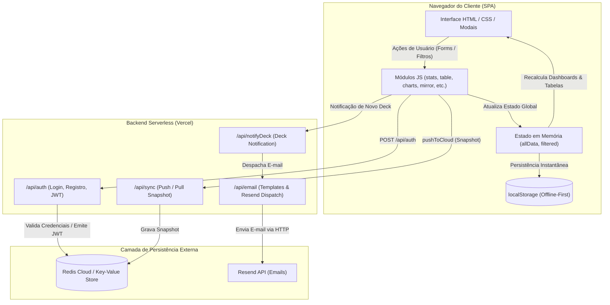

# Mapa do Sistema — Jornada TCG Team

**Status:** VERIFIED  
**Mapeamento Arquitetural:** Fluxo de Dados End-to-End

---

## 1. Diagrama de Fluxo de Dados Real

---

## 2. Entradas e Saídas por Componente

### A. Registro de Partidas (Full Match Form & Quick Log)
- **Entradas:** Jogador (travado no autenticado), Oponente, Deck Próprio, Deck Adversário, Formato (MD1/MD3), Placar, Resultado (V/D/E), Brick (Sim/Não), Confiabilidade, Local, Data, Comentários, Listas de Cartas.
- **Processamento:**
  1. Validação de campos obrigatórios e bloqueio de duelo contra si mesmo.
  2. Cálculo do próximo `seqID = max(seqID) + 1`.
  3. Geração de timestamp `createdAt`.
  4. Detecção de oponente do time: criação automática da partida espelho (`mirrorMatch`).
  5. Gravação em `localStorage` via `saveManual`.
  6. Disparo assíncrono de `pushToCloud` para sincronização com Redis.
- **Saídas:** Tabela atualizada com a nova partida no topo da Página 1, recálculo instantâneo de Winrates, Matchups, MD3 e gráficos.

### B. Autenticação e Sessão
- **Entradas:** Nome do Jogador, E-mail, Senha.
- **Processamento:**
  1. Hash PBKDF2 (SHA-256) com salt aleatório em `api/auth.js`.
  2. Verificação de unicidade de e-mail e vínculo de jogador (`player_claim_*`).
  3. Emissão de JWT (HMAC-SHA256) armazenado no `localStorage` sob `jornada_auth_token`.
  4. Disparo automático do e-mail de boas-vindas profissional via Resend API.
- **Saídas:** Sessão ativa no cliente, bloqueio de inputs para identidade própria e liberação de permissões de edição/exclusão.

### C. Estatísticas e Dashboards
- **Entradas:** Array filtrado (`window.filtered`).
- **Processamento:**
  1. Filtros combinados multi-critério em `js/filters.js`.
  2. Cálculo de Win Rate global, 1º vs 2º, Brick Rate e MD3 Game Breakdown em `js/stats.js` e `js/md3.js`.
  3. Matriz cruzada de arquétipos em `js/matchup.js`.
- **Saídas:** Renderização de métricas e gráficos Chart.js / barras customizadas com contorno de contraste de 2px.
