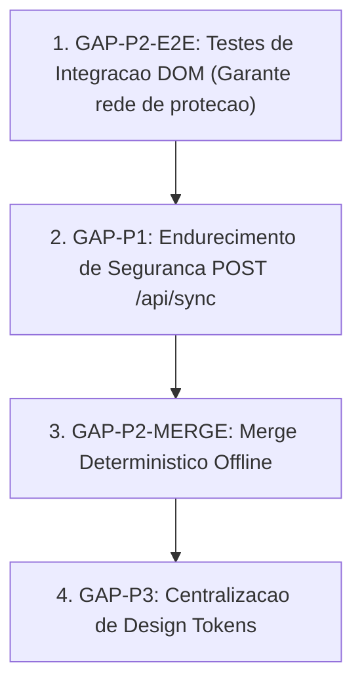

# Master Engineering Roadmap — Jornada TCG Team

**Status:** READY_FOR_EXECUTION_PHASES  
**Versao Atual:** 1.8.2  
**Maturidade SDD:** LEVEL 4  

---

# Current State
A base do projeto esta 100% auditada, coberta por 5 suites de testes unitarios no Vitest, com SDD Gate automatizado (32/32 testes aprovados) e CI/CD configurado. 4 GAPs foram identificados e estruturados em Change Plans detalhados.

---

# GAPs & Prioritization

| GAP ID | Severidade | Dominio | Descricao Resumida |
|---|---|---|---|
| **GAP-P1** | **P1 - HIGH** | Seguranca / API | Endurecimento de autorizacao JWT no `POST /api/sync` contra mutacoes anonimas |
| **GAP-P2-MERGE** | **P2 - MEDIUM** | Dados / Consistencia | Merge deterministico comutativo para multiplos registros offline |
| **GAP-P2-E2E** | **P2 - MEDIUM** | QA / Testes | Expansao de testes de integracao DOM com `jsdom` cobrindo submissao de forms e filtros |
| **GAP-P3-TOKENS** | **P3 - LOW** | Frontend / DX | Centralizacao de constantes de cor e design tokens |

---

# Dependencies & Recommended Execution Order

### Racional da Ordem Tecnica:
1. **Primeiro GAP-P2-E2E:** Criar os testes de integracao DOM antes de mexer na camada de sincronizacao e seguranca garante que qualquer refatoracao no frontend seja validada instantaneamente contra quebras de interface.
2. **Segundo GAP-P1 (Seguranca):** Elimina a principal vulnerabilidade de sobrescrita anonima da API de sync.
3. **Terceiro GAP-P2-MERGE (Dados):** Implementa a regra matematica comutativa de fusao de partidas apos a seguranca da API estar blindada.
4. **Quarto GAP-P3 (Design Tokens):** Refinamento de codigo limpo sem risco funcional.

---

# Milestones & Gates

- **Milestone 1:** Suite E2E/DOM operacional no Vitest (`npm test`).
- **Milestone 2:** `POST /api/sync` protegido com 401/403 para nao autenticados e spec `SPEC-004`/`SPEC-005` atualizadas.
- **Milestone 3:** Algoritmo `deterministicMergeMatches` validado com testes de concorrencia comutativa.
- **Milestone 4:** Tokens de estilo centralizados e release v1.9.0.

---

# Definition of Ready
Um GAP so inicia implementacao se possuir:
- Change Plan com Threat Model / Invariantes matematicas aprovadas.
- Testes planejados antes do codigo.
- Procedimento de rollback documentado.

---

# Definition of Done
Um GAP e considerado concluido quando:
- Codigo implementado e validado com `node -c`.
- Todos os testes unitarios e de integracao passarem no Vitest.
- `npm run validate:sdd` passar 100% dos gates.
- Bundle de producao compilado com Terser e deployado na Vercel.
