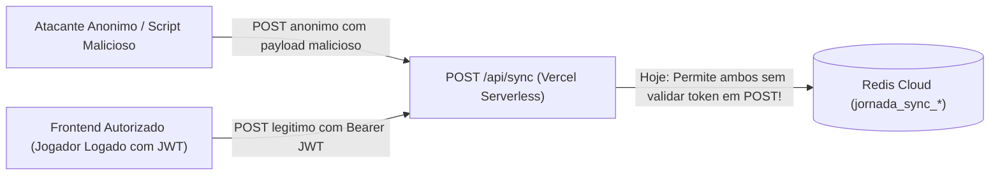

# Change Plan: GAP-P1 — Endurecimento de Seguranca do Endpoint `POST /api/sync`

**Severidade:** P1 — HIGH  
**Dominio:** Backend Serverless & Autenticacao  
**Status do Plano:** READY_FOR_REVIEW  

---

## 1. Threat Model (Modelo de Ameacas)



### Ameacas Identificadas:
1. **Sobrescrita Anonima Total (CWE-306):** Qualquer cliente HTTP pode enviar `POST /api/sync` sem header `Authorization` e sobrescrever a chave global `jornada_sync_team_default_sync` no Redis.
2. **Payload Size Denial of Service (CWE-400):** Nao ha verificacao de tamanho maximo de payload (ex: payload de 50MB esgotando memoria serverless).
3. **Injecao de Estrutura Nao-Conforme (CWE-20):** Nao ha validacao de tipo garantindo que `manualMatches` seja um Array de partidas validas.
4. **Ausencia de Rate Limiting:** Sem limite de requisicoes por IP, permitindo flood no Redis.

---

## 2. Fluxo Atual vs Fluxo Recomendado

### Fluxo Atual (Inseguro):
1. Frontend chama `POST /api/sync?token=team_default_sync`.
2. Se o usuario estiver logado, envia `Authorization: Bearer <jwt>`, mas o backend ignora se o payload for nulo e processa a gravacao mesmo sem token valido.
3. Se o usuario nao estiver logado, a requisicao passa sem token e grava no Redis sob a chave padrao.

### Fluxo Recomendado (Arquitetura Proposta):
1. **Reaproveitamento da Autenticacao JWT Existente (Opcao C + D):**
   - O endpoint `POST /api/sync` **exige obrigatoriamente** cabecalho `Authorization: Bearer <jwt_valido>`.
   - O backend valida a assinatura HMAC-SHA256 e a expiracao do token.
   - Requisicoes `POST` sem token valido retornam imediatamente `HTTP 401 Unauthorized`.
   - Requisicoes `GET` (leitura publica para exibicao do dashboard em modo visualizacao) continuam permitidas com token de time, mas `POST` (mutacao de dados) e restrito a membros autenticados.
2. **Validacao Estrita de Schema:**
   - Payload deve ter no maximo **2MB**.
   - `payload.manualMatches` deve ser um Array onde cada item deve ter `id` e `Data`.
3. **Logs Estruturados Sem Dados Sensiveis:**
   - Logar apenas `{ user: userPayload.username, matchesCount: payload.manualMatches.length, timestamp: ISO }`.

---

## 3. Alternativas Avaliadas

| Alternativa | Pros | Contras | Decisao |
|---|---|---|---|
| **A) Secret Compartilhado Estatico** | Simples | Secret ficaria exposto no codigo do browser | **REJEITADO** |
| **B) Token Estatico por Usuario** | Facil implementacao | Dificuldade de revogacao e rotacao | **REJEITADO** |
| **C) Autenticacao JWT Existente** | Zero atrito; infraestrutura ja existente e testada no `api/auth.js` | Exige login previo para salvar na nuvem | **ESCOLHIDA (Recomendada)** |

---

## 4. Impacto em Clientes Offline & Compatibilidade
- **Operacao Offline:** Jogadores continuam registrando partidas normalmente no `localStorage`. Ao reconectar a internet, se o token JWT estiver expirado, o sistema exibe toast: *"Sua sessao expirou. Faca login para enviar os dados para a nuvem"*, preservando os dados intactos no `localStorage` ate o login.

---

## 5. Plano de Implementacao (Passo a Passo)

1. **Backend (`api/sync.js`):**
   - Importar validador e aplicar verificacao estrita no inicio do handler:
     ```javascript
     if (req.method === 'POST') {
       if (!bearerToken) {
         return res.status(401).json({ error: 'Autenticacao obrigatoria para sincronizacao na nuvem.' });
       }
       const user = verifyJwt(bearerToken);
       if (!user) {
         return res.status(403).json({ error: 'Token invalido ou expirado. Faca login novamente.' });
       }
     }
     ```
   - Adicionar checagem de tamanho (`JSON.stringify(req.body).length < 2097152`) e validacao de array (`Array.isArray(req.body.manualMatches)`).
2. **Frontend (`js/sync_cloud.js`):**
   - Se `pushToCloud()` receber `401` ou `403`, acionar `setSyncStatus('error', 'Login necessario para sincronizar')` e solicitar login nao-bloqueante.
3. **Testes (`tests/sync_security.test.js`):**
   - Teste 1: `POST /api/sync` sem header -> Espera 401.
   - Teste 2: `POST /api/sync` com token invalido -> Espera 403.
   - Teste 3: `POST /api/sync` com token valido -> Espera 200.
   - Teste 4: `GET /api/sync` -> Permite leitura.

---

## 6. Criterios de Aceite
- [ ] Requisicoes `POST /api/sync` sem JWT valido sao bloqueadas com 401/403.
- [ ] Usuarios logados realizam sincronizacao normalmente sem interrupcao.
- [ ] Jogadores offline nunca perdem partidas salvas localmente caso a nuvem rejeite por falta de login.
- [ ] Suite de testes automatizados cobre todos os cenarios de autenticacao da API.
