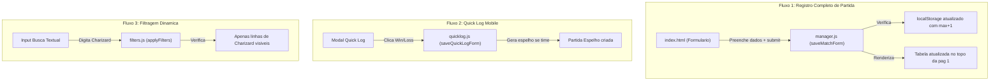

# Change Plan: GAP-P2 — Expansao da Suite de Testes de Integracao e DOM

**Severidade:** P2 — MEDIUM  
**Dominio:** Qualidade de Software (QA) & Testes  
**Status do Plano:** READY_FOR_REVIEW  

---

## 1. Diagnostico da Cobertura Atual

- **Testes Unitarios Puros:** `stats.test.js`, `mirror.test.js`, `md3.test.js`, `email.test.js` possuem cobertura robusta e rodam em microssegundos.
- **Lacuna Identificada:** Os fluxos orientados a eventos de interface em `manager.js`, `quicklog.js` e `filters.js` dependem de elementos DOM especificos (`#formMatchPlayer`, `#quickLogPlayerBadge`, `#filterSearch`, `#tableMatchesBody`). Alteracoes em IDs no `index.html` podem causar falhas silenciosas na interface que os testes unitarios atuais nao detectam.

---

## 2. Fluxos Criticos a Serem Cobertos com JSDOM

---

## 3. Plano de Implementacao

1. **Criar `tests/dom_integration.test.js`:**
   - Carregar o DOM real a partir de `index.html` via `jsdom`.
   - Teste 1: Simulacao do fluxo de submissao do formulario de partida completa com player logado.
   - Teste 2: Simulacao de tentativa de duelo contra si mesmo (deve exibir erro e bloquear submissao).
   - Teste 3: Simulacao de insercao com data futura (deve ser rejeitada).
   - Teste 4: Simulacao de busca textual dinamica no filtro global.
2. **Integracao no Vitest:**
   - Executado automaticamente no `npm test` e no pipeline do GitHub Actions.

---

## 4. Criterios de Aceite
- [ ] Testes de integracao cobrem submissao de formularios e filtros no DOM real.
- [ ] Tempo total de execucao da suite permanece abaixo de **2 segundos**.
- [ ] Qualquer quebra de ID ou seletor essencial no `index.html` falha a suite no CI.
